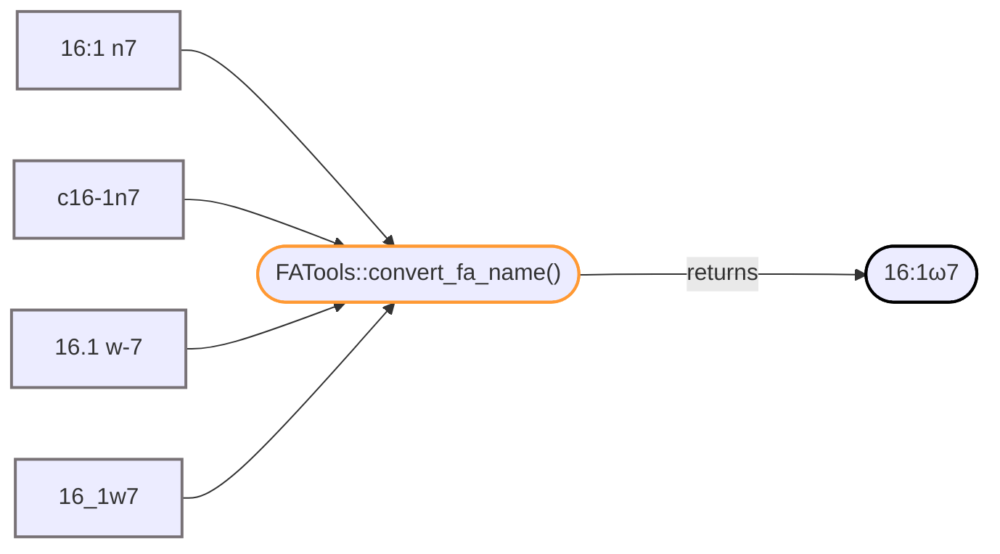

<!-- README.md is generated from README.Rmd. Please edit that file -->

# **FATools**

<!-- badges: start -->


<!-- badges: end -->

R package for working with fatty acid data derived from gas
chromatography and mass spectrometry.

## **Overview**

**FATools** aims to streamline and enhance the analysis of fatty acid
(FA) data using R. It’s primary goal is to promote traceability and
reproducibility of results, while also seeking to reduce laboratory
reliance on expensive proprietary software. **FATools** development is
currently focused on automating common workflows involved in exporting
gas chromatographic (GC) and mass spectrometric (MS) data from GC/MS
software and post-processing that data prior to further analysis. Many
**FATools** functions may be used for general GC/MS data, however, the
package is focused on the analysis of FA data and some functions are
specific to this group of lipids.

## **Getting Started**

### Prerequisites

Having the [devtools](https://devtools.r-lib.org/) package installed
greatly simplifies installing **FATools** directly from this repository.

``` r
# Install devtools from CRAN
install.packages("devtools")
library(devtools)
```

### Installation

To install **FATools** on your machine, I recommended installing the
[latest release](https://github.com/miketommus/FATools/releases).
Released versions of the package are more stable and better documented.

``` r
# Install latest release
devtools::install_github("miketommus/FATools@v0.1.0-alpha")
library(FATools)
```

If you’re feelin’ froggy & want to install the current development
version (bugs & all):

``` r
# Install development version
devtools::install_github("miketommus/FATools")
library(FATools)
```

## **Using FATools**

### Concept of Operations

**FATools** is designed to accept data as chromatogram peak areas in
cross-tab format (compounds as columns, samples as rows) and perform all
computation necesary to end up with compound tissue concentrations or
compound proportions; whichever is desired. Below is a simplified view
of this workflow.


### Example Scripts

**FATools** documentation is pretty sparse at the moment. Vignettes for
each function will be added shortly, but, in the mean time, if you’d
like to see a detailed example of how **FATools** is used to
post-process fatty acid GC/MS data, you can find an example script and
test data here:
[github.com/miketommus/example-fatty-acid-analysis](https://github.com/miketommus/example-fatty-acid-analysis)


## **Highlighted Features**

### Fatty Acid Names

One of the core features of **FATools** is the ability to standardize
fatty acid (FA) names. In fact, this is an important first step because
many **FATools** functions rely on matching FA names to work properly.

If you’ve ever worked with FA names in Excel, you know Excel likes to
auto-format things containing “:” or “.”. As a result, you’ve probably
come up with some creative ways to list FA in your spreadsheets and then
realized you have to convert those names again when it’s time to publish
your results. The convert_fa_name() function simplifies this process and
allows the user to easily standardize and customize how FA names are
written.

Example:



<br> <br> Customizing the output is also possible:


### Instrument Response Factor Mapping

Another useful feature of **FATools** is it’s ability to quantitate
compounds for which the user doesn’t have external standards. In gas
chromatography similar compounds generally have similar response factors
(RF). This means it’s possible to map RF values from standards to
similar compounds that aren’t in the standards.

In some GC/MS software packages this process often involves workarounds
that aren’t easily traceable or reproducible. **FATools** automates this
task when you pass an optional data frame into
FATools::convert_area_to_conc() showing how compounds should be mapped
to the RFs of standards.

Example:


## **A Word of Caution**

**FATools** is in early devlopment and is not ready to be used in
production code.

Feel free to install and play around with the package, but be warned
that function names and other breaking changes may be made to the
package. Don’t use any of these functions in any production code at this
stage unless you download the source code and store it along with your
analysis (see **Download Old Versions** below). That way you have a
record of the state of the package when you ran your analysis.

### Download Old Versions

You can find copies of all FATools [releases
here](https://github.com/miketommus/FATools/releases).

## **Contributing**

**FATools** is in the early stage of development right now and it’s
architechture might change quite drastically in the near future. As a
result, outside contibutors should hold-off on submitting pull-requests
for the time being to avoid wasted time/effort. I expect this to change
as the package matures!

### Development notes

If you’d like to learn more about the development progress of
**FATools** and follow along as new features are developed, visit the
[**FATools** development
notes](https://github.com/miketommus/FATools_dev) repository.

### Reporting Issues & Bugs

Right now, the only bug/issue reports accepted are from those doing
early testing. If you have (or can find) miketommus’ non-public contact
information feel free to report any issues you find there.
